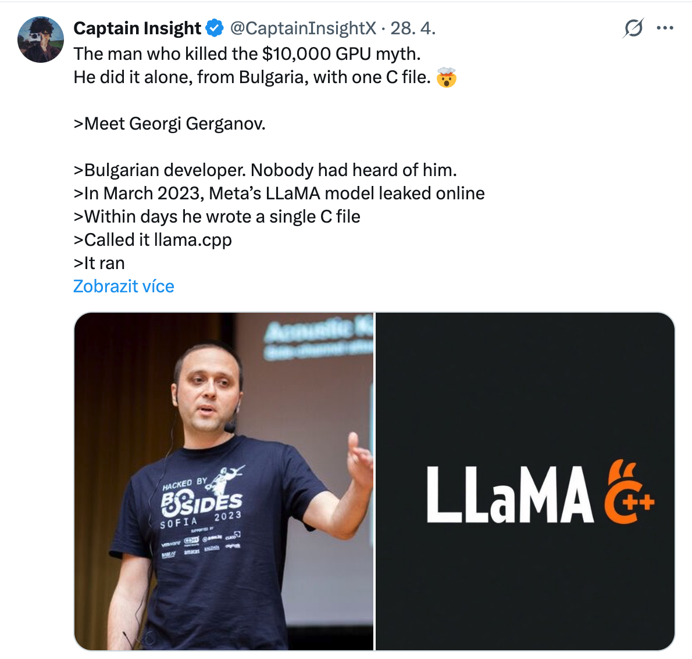
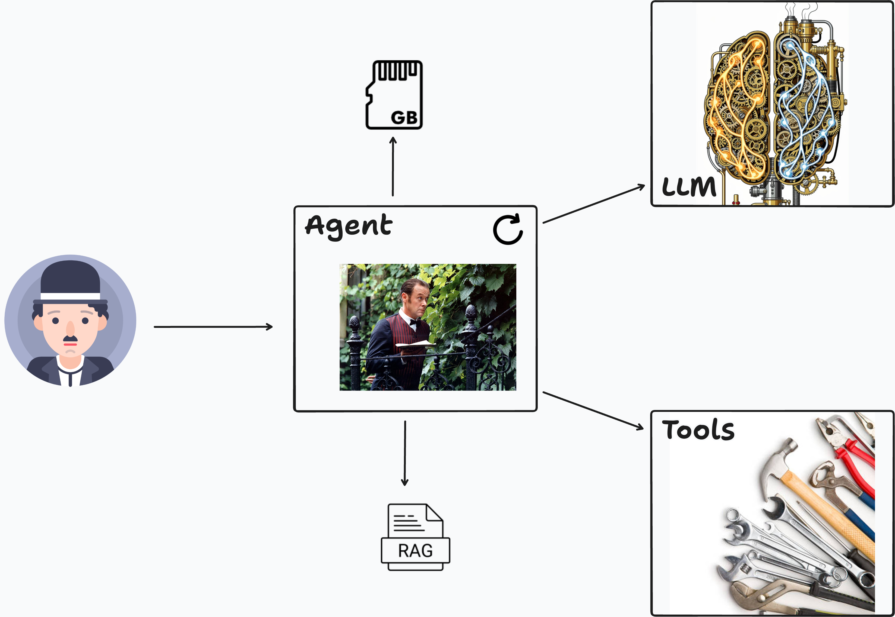
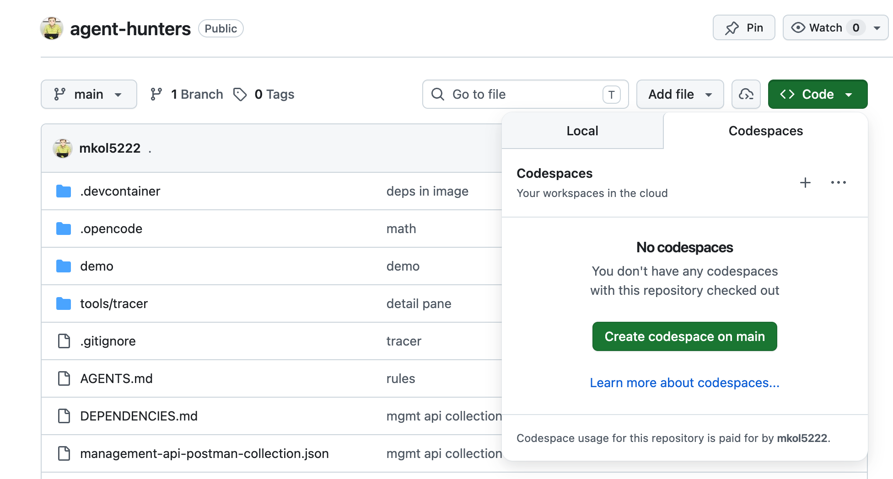
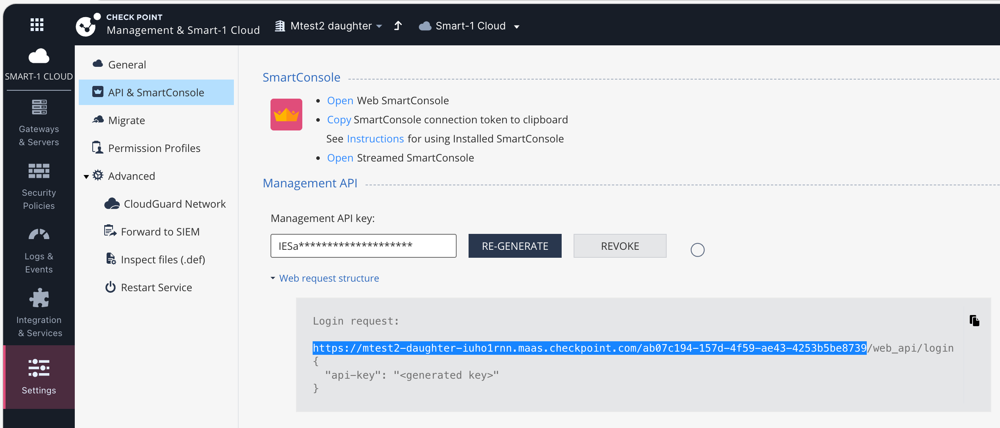
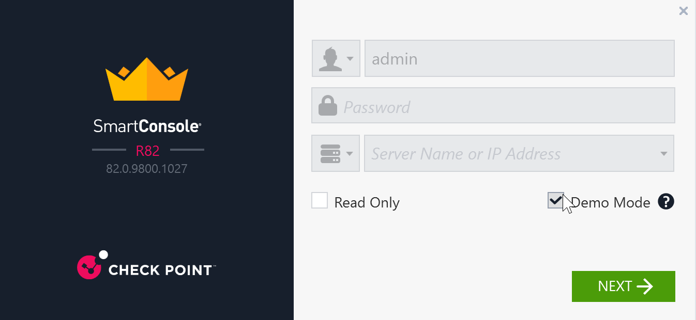
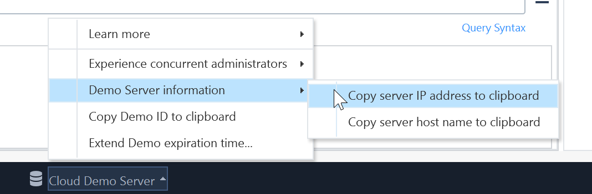
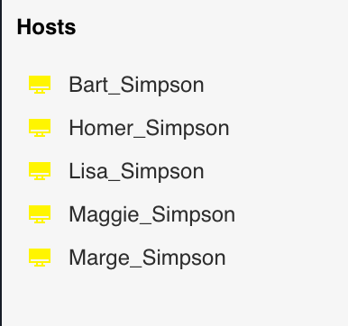
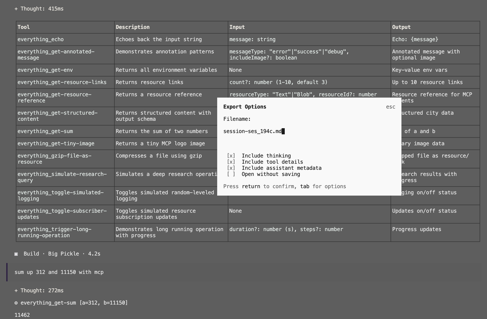
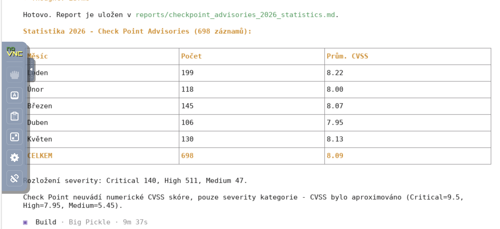

---
# try also 'default' to start simple; seriph
theme: seriph
# random image from a curated Unsplash collection by Anthony
# like them? see https://unsplash.com/collections/94734566/slidev
background: ./img/saturnin-bathory.png
# some information about your slides (markdown enabled)
title: |
  Servus bonus,
  dominus malus est
info: |
  ## Slidev Starter Template
  Presentation slides for developers.

  Learn more at [Sli.dev](https://sli.dev)
# apply UnoCSS classes to the current slide
class: text-center
# https://sli.dev/features/drawing
drawings:
  persist: false
# slide transition: https://sli.dev/guide/animations.html#slide-transitions
transition: slide-left
# enable Comark Syntax: https://comark.dev/syntax/markdown
comark: true
---

# Servus bonus,<br>dominus malus est

<div @click="$slidev.nav.next" class="mt-12 py-1" hover:bg="white op-10">
  <carbon:arrow-right />
</div>

<div class="abs-br m-6 text-xl">
  <button @click="$slidev.nav.openInEditor()" title="Open in Editor" class="slidev-icon-btn">
    <carbon:edit />
  </button>
  <a href="https://github.com/slidevjs/slidev" target="_blank" class="slidev-icon-btn">
    <carbon:logo-github />
  </a>
</div>

<!--
The last comment block of each slide will be treated as slide notes. It will be visible and editable in Presenter Mode along with the slide. [Read more in the docs](https://sli.dev/guide/syntax.html#notes)
-->


---
layout: two-cols
layoutClass: gap-8
class: text-left
---

# Novinky: 6 měsíců v AI 
# do 5ti minut

<ol class="mt-8 space-y-5 text-2xl leading-snug">
  <li>AI se opět zlepšila v kreslení pelikánů na kole</li>
  <li>Jistý Peter z Rakouska udělal v listopadu první commit do projektu Warelay</li>
  <li>Více s méně, doma</li>
</ol>

::right::

<div class="grid grid-cols-2 gap-3 pt-4">
  
  
  
</div>

[@simonw](https://x.com/simonw) · [@steipete](https://x.com/steipete) · [@CaptainInsightX](https://x.com/captaininsightx)

[Peter Steiberger @ TED, April 2026](https://www.youtube.com/watch?v=7rzYDM6vMtI)

---
layout: center
class: text-center
---



---
layout: two-cols
layoutClass: gap-10
class: text-left
---

# Usecase: Pozvat si agenta "domů" a učit se od něj

Killercoda je naše hřiště:

https://killercoda.com/playgrounds/scenario/kubernetes

Opencode je agent s LLM službou a nástroji, podobně jako Claude Code od Anthropic:

https://opencode.ai/


```bash
# Instalace opencode agenta
curl -fsSL https://opencode.ai/install | bash

# new terminal tab

# Spuštění agenta
opencode

# nebo web UI
OPENCODE_SERVER_PASSWORD=vpn123 opencode web --hostname 0.0.0.0
# opencode / vpn123
```


::right::

Prompty:

```markdown
Na jakém běžím stroji a proč je to občas pomalé?

Jsi na Kubernetes clusteru, seznam mě s ním 
v přehledné tabulce. 
Jaké nody, jaké workloady, jaké zdroje.

kubectl. Spusť mi nginx kontejner 
a vypublikuj ho a poraď postup, 
jak se k němu dostanu zvenku. 
curl one-liner pro otestování, že běží.
```

---
layout: two-cols
layoutClass: gap-10
class: text-left
---

# Usecase: Něco trvalejšího - Codespace jako domeček pro agenta

Github Codespace (nebo Dev Container lokálně) jako prostředí pro agenta, který se může učit a pracovat s nástroji, které tam dáme:

https://github.com/mkol5222/agent-hunters



::right::

Opencode a další nástroje předinstalovené v Codespace, přístup k repozitáři, terminálu, Internetu, atd.


```bash
# Spuštění agenta z terminálu Codespace
opencode

# /model - Big Pickle

# nebo web UI
opencode web

# reporty - port forwarded to browser
(mkdir -p reports && cd reports && npx -y http-server -p 11150)
```


Prompty:

```markdown
Na jakém běžím stroji a proč je to občas pomalé?
Udelěj mi přehlednou tabulku s informacemi 
o CPU, RAM, GPU, atd. do krásneho světlého 
HTML reportu hw.html 
a ulož ho do složky reports.
```


---
layout: two-cols
layoutClass: gap-10
class: text-left
---

# Usecase: Check Point 
# na hraní

Na učení a při sdílení dat nebo dokonce hesel s poskytovatelem LLM lze pro experimenty využít i Check Point S1C  *1 day demo* na 
https://portal.checkpoint.com/dashboard/security-management#/welcome


::right::

Klíčové know-how je S1C_URL a API_KEY:


Prompty:

```markdown
check point talks @management-api-postman-collection.json 
on https://mtest2-daughter-iuho1rnn.maas.checkpoint.com/ab07c194-157d-4f59-ae43-4253b5be8739/web_api/login 
using API_KEY IESafnDKwEgmLNaHJ3UcQA== - 
login and show me table of network objects
```

---
layout: two-cols
layoutClass: gap-10
class: text-left
---

# Usecase: Check Point 
# a LOGY na hraní

Na učení a při sdílení dat nebo dokonce hesel s poskytovatelem LLM lze pro experimenty využít i Check Point SmartConsole *demo mode*, který je také sustupný na IP adrese, lze prodloužit a má známehé uživatele admin / demo123:



::right::

Klíčové know-how je IP adresa a USERNAME / PASSWORD z tajného menu:


Prompty:

```markdown
check point talks @management-api-postman-collection.json 
on IP 63.180.230.42
using USERNAME admin and PASSWORD demo123 - 
login and show me last 10 Threat Emulation logs
```

---
layout: two-cols
layoutClass: gap-10
class: text-left
---

# Usecase: Změny do Check Pointu

Prompty:

```markdown
/new

check point talks @management-api-postman-collection.json 
ask me for S1C_URL and API_KEY and then login
and show me last 3 audit logs
```



```markdown
založ 5 host objektů podle The Simpsons,
žluté barvy, na segmentu 172.16.0.0/16,
od .55 výše, publikuj
```

::right::


```markdown
uplně nahoře v bázi access pravidel
přidej pravidlo, které povolí 
provoz z "Simpsons" hostů ve skupine TheSimpsons
do síťě Springfield 192.168.77.0/24
na službách http, https, dns, MQTT, SSHv2
s logováním provozu. vypublikuj.
```

---
layoutClass: gap-10
class: text-left
---

# Usecase: Konzumace přes MCP Server /1/

MCP Inspector https://npmx.dev/package/@modelcontextprotocol/inspector
je POSTMAN pro MCP servery a jejich ladění

```bash

npx -y @modelcontextprotocol/inspector npx -y @modelcontextprotocol/server-everything
```

```bash
npx -y @modelcontextprotocol/inspector npx -y @chkp/quantum-management-mcp
```

```bash
npx -y @modelcontextprotocol/inspector --server-url https://mcp-oauth.mkoldov.workers.dev/mcp --transport http --auth-type oauth 

```

```bash
cat opencode.json
```
```json
{
  "$schema": "https://opencode.ai/config.json",
  "mcp": {
    "everything": {
      "type": "local",
      "command": ["npx", "-y", "@modelcontextprotocol/server-everything"],
      "enabled": true
    }
  }
}
```


---
layoutClass: gap-10
class: text-left
---

# Usecase: Konzumace přes MCP Server /2/

Prompty:

```markdown
/mcp

use echo mcp tool with current timestamp in iso format

what tools does everything mcp have? show me in a table with name, description, input and output format

sum up 312 and 11150 with mcp
```

Ctrl-P - export session transcript to markdown file with timestamp in name




---


# Use case: vyhodnocení komplexního logu s prolínajícími se transakcemi a možnými problémy
Prompty:

```markdown
precti @ted.elg a spoj informace podle unikatnioho identifikatoru transakce za jeden soubor. zpracuj do svetleho prehledneho reportu pro porozumeneni prubehu vyhodnoceni souboru, verdiktu, trvani a moznych problemu behem zpracovani. jediny html report bez vnejsich zavislosti
```

```bash
cd reports && npx -y http-server -p 11150
```

---
layoutClass: gap-10
class: text-left
---

# Use case: relevantní informace a chování na základě rozsáhlé dokumentace

```bash
npx -y ctx7 setup --opencode
```

Prompty:
```markdown
pouzij /chkp-antonr/checkpoint-api-ref s context7
a udelej malou ukazku, jak se prihlasim do check point managementu
a zalozim network feed s URL https://feeds.demo.local/f1
s flat IP listem a aktualizaci jednou za 5 minut.
vypublikuju, odhlasim. krok za krokem vysvetluj
```

https://context7.com/chkp-antonr/checkpoint-api-ref?chat=493696c7-4f74-4646-9c03-80e16704aa53&tab=chat

---
layoutClass: gap-10
class: text-left
---

# Use case: skills a ovládání prohlížeče

<details>
<summary>Instalace a spuštění</summary>

```bash
npx -y skills

npx -y skills find "agent browser"

npx -y skills add vercel-labs/agent-browser@agent-browser -y

opencode

# /skills
```

</details>

Prompty:
```markdown
pouzij agent browser skill a headed otevri 
advisories.checkpoint.com a shrn prvni 3 polozky
z tabulky s CVE, CVSS, popisem a odkazem.

pouzij agent browser skill a headed otevri 
advisories.checkpoint.com - stahni seznamy zranitelnosti
ze stranek pro rok 2026 a udelaj statistiku s poctem zranitelnosti 
za jednotlive kalendarni mesice, spocitej za mesic prumerne CVSS.
kdyz bude treba vyresit captcha, zeptej se uzivatele, at to vyresi.
```


---
layoutClass: gap-10
class: text-left
---

# Use case: prezentace zákazníkovi

```bash
npx -y skills find "powerpoint opencode"
npx -y skills add igorwarzocha/opencode-workflows@powerpoint -y
```

Prompty:
```markdown
pouzij powerpoint skill a vytvor prezentaci s 5ti slidama o tom,
co je to opencode, jak se instaluje, jak se pouziva, a jak se 
da pouzit pro check point management. 
dej tomu pekny design a pridavej relevantni obrazky.
```

---


# Learn More

[opencode](https://opencode.ai/) · [GitHub](https://github.com/mkol5222/agent-hunters) · [CHKP MCP Servers](https://mcp.checkpoint.com/)

<PoweredBySlidev mt-10 />
